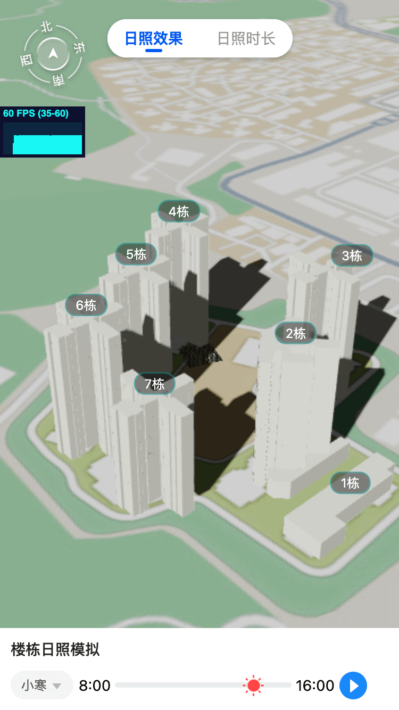
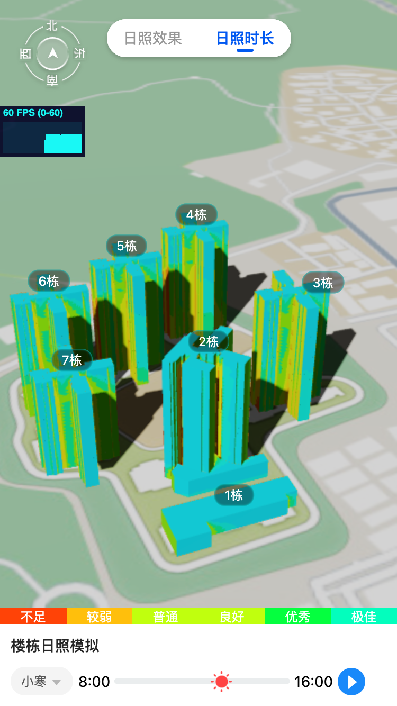

# 3D楼栋太阳光照模拟
功能: 日照模拟, 可视化展示日照时长

- 技术栈:使用vue3 + threejs + vantUI
- 日照时长计算使用: suncalc.js








## Project setup

```
yarn install
```

### Compiles and hot-reloads for development

```
yarn serve
```

### Compiles and minifies for production

```
yarn build
```
